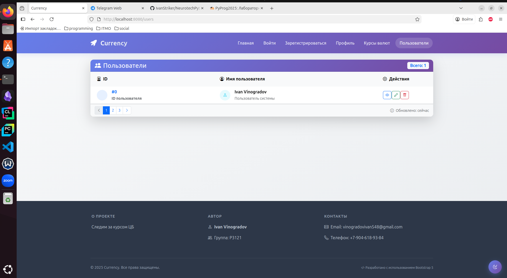
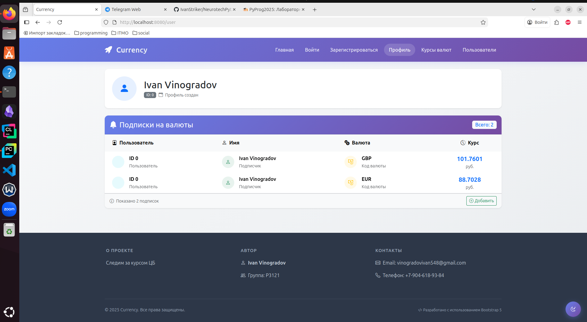
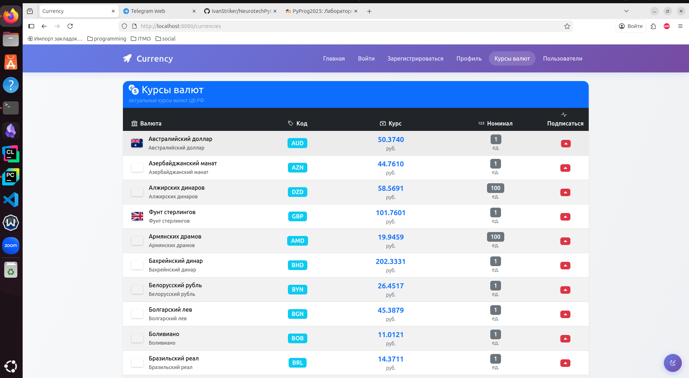
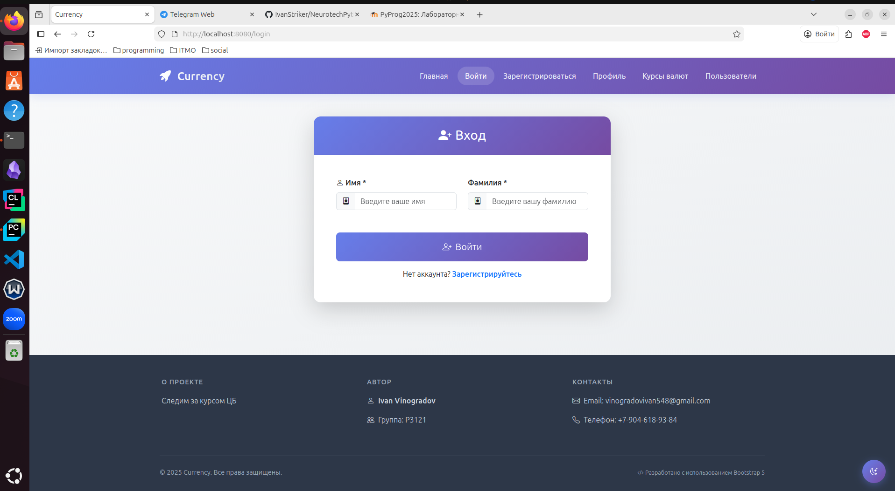
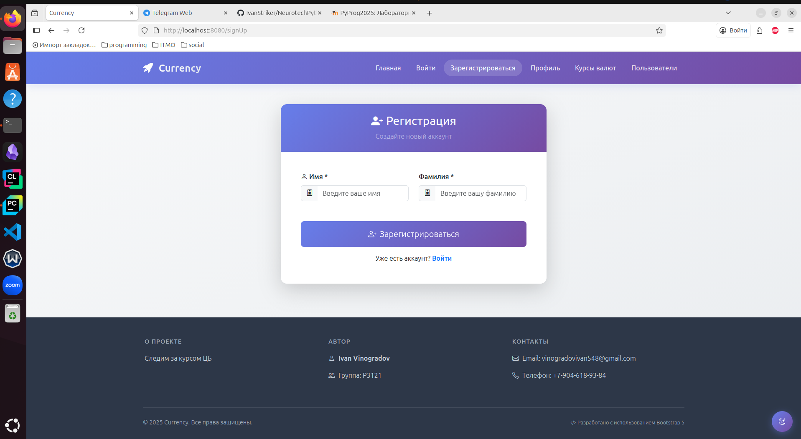
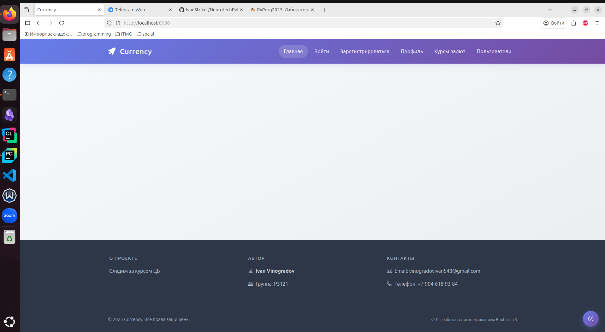
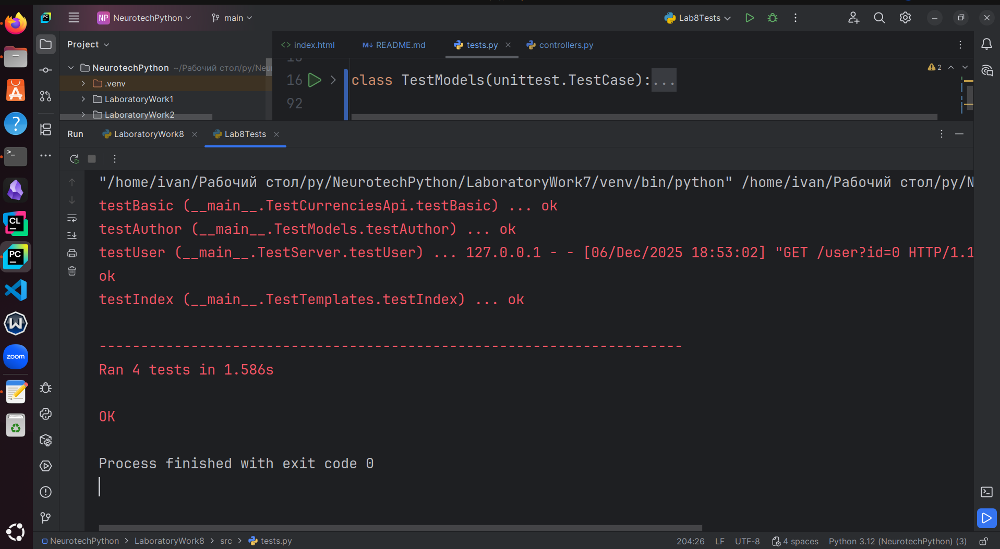

# A site for currency rates' tracking

## Purposes: 
- **learn to create simple sites without frameworks**
- **explore the inner processes of client-server interactions**
## Main models included:
- User
- Currency
- UserCurrency: represents a subscription of a user. It contains ids of both user and it's currency, realizing 'many to many' linking
- Author (of the application)
- App (the application itself)
## Base models (models-predecessors):
- BaseModel: represents an abstract model, consisting entirely of the only id field
- Human: representing an abstract human, including only a name.

## Files structure:
- `src/myapp.py` - contains the entry point
- `src/models/` - all the model classes
- `src/templates` - html templates
- `src/myTemplates` - additional html templates
- `src/utils` - other classes and functions that were useful when I was making the size
- `src/requests_handler.py` - realizes the server's working logic
- `src/data.py` - contains most of the project's global data
- `src/controllers.py` - routes handlers
- `src/views.py` - html renderers

## Models in detail:
- **class** BaseModel
  - **private:**
    - __id: str
  - **public:**
    - id(set, get)
  - **restrictions:**
    - None
- **class** _Human_
  - **private:** 
    - __id: str
    - __name: str
  - **public:** 
    - id(set, get)
    - name(set, get)
  - **restrictions:**
    - name field must consist of at least one letter
- **class** _User_ **extends** BaseModel, Human
- **class** _Currency_ **extends** BaseModel
  - **private:**
    - __num_code: int
    - __char_code: str
    - __name: str
    - __value: float
    - __nominal: int
  - **public:** 
    - num_code(set, get)
    - char_code(set, get)
    - name(set, get)
    - value(set, get)
    - nominal(set, get)
    - parseDict() -> {
          "id": self.id,
          "name": self.name,
          "charCode": self.char_code,
          "value": self.value,
          "nominal": self.nominal,
      }
  - **restrictions:**
    - char_code's length must be equal to 3
    - name mustn't be empty
    - value and nominal must be positive
- **class** _UserCurrency_ **extends** BaseModel
  - **private:**
    - __user_id: str
    - __currency_id: str
  - **public:** 
    - user_id(set, get)
    - currency_id(set, get)
  - **restrictions:**
    - None
- **class** _Author_ **extends Human**
  - **private:**
    - __group: str
  - **public:**
    - group(set, get)
  - **restrictions:**
    - group must include at least 5 characters
    - group must have a leading upper-letter character
- **class** _App_
  - **private:**
    - __name: str
    - __author: _Author_
    - __version: str
  - **public:**
    - name(set, get)
    - author(set, get)
    - version(set, get)
  - **restrictions:**
    - name must include at least one letter
    - version can only consist of digits and dots
## Example of work
I must confess to using deepseek while creating frontend.
HTML code created on my own you can find in `src/myTemplates/`
1. `/users`

2. `/user?id=0`

3. `/currencies`

4. `/login`

5. `/signUp`

6. `/root`

7. `/author`

8. `/login?...`, `/signUP?...`, `/currencies/subscribe?id=`

## Testing
- All the tests are placed in `src/tests.py`
- There are 3 classes representing different cases of testing
- TestModels allows to estimate the model classes' constructors', getters' and setters' accuracy
- TestCurrenciesApi helps to test whether get_currencies function works correctly
- TestServer creates a server and its client in different threads and demonstrates that every route is handled by the server
- TestTemplates finds out if html documents are written without mistakes
## Here are some examples of the tests and their results
```python
def testAuthor(self):
    with self.assertRaises(ValueError):
        models.Author("Ivan", "03121")
    author = models.Author("Ivan", "P3121")
    self.assertEqual(author.name, "Ivan")
    self.assertEqual(author.group, "P3121")

    with self.assertRaises(ValueError):
        author.name = "-"
    with self.assertRaises(ValueError):
        author.group = "0"

# ----------------------------------------
def testBasic(self):
    lst = ['AUD', 'AZN', 'DZD']
    curs = get_currencies(lst)
    for item in curs.values():
        self.assertTrue(isinstance(item, models.Currency))
        self.assertIn(item.char_code, lst)
# ----------------------------------------
def testUser(self):
    response = requests.get("http://localhost:8080/user?id=0")
    response.raise_for_status()
    self.assertEqual(
        response.content,
        bytes(views.profile(data.users["0"]), encoding="utf-8")
    )
# ----------------------------------------
def testIndex(self):
    html = data.templates["index"].render(
        **baseTemplateKwargs
    )
    self.assertIn(data.app.name, html)
    self.assertIn(data.author.name, html)
    self.assertIn(data.author.group, html)
```

## Conclusion
- Hardships I've been faced
  - The most tricky part was debugging: I spent uncountably amount of time searching for mistakes
  - It was also hard to divide the program into logical pieces, so that it would be easy to add extra functionality
  - I'm not so experienced in web and I certainly haven't used to writing most of the logic myself (without using frameworks) 
    - In particular, It was really complicated to create Session logic. And to be honest, it still isn't working, as I wanted.
  - As for frontend, it is quite easy to make some simple pages with no styling, but I don't have enough skills to make a stylish product
## How did I follow MVC consept?
- I isolated viewers, controllers and models from the other logic
- they can be easily changed 'cause there aren't so many dependencies
## What new did I learn about HTTPServer and Jinja2?
- You can really upgrade your skills by using them instead of frameworks
- They are very flexible, but no so good if all you need is to solve a standard problem (it takes much time to do a task like this using only Jinja2 and python std libraries)
- I learnt how to create session objects in cookie
- I practised multithreading programming a bit