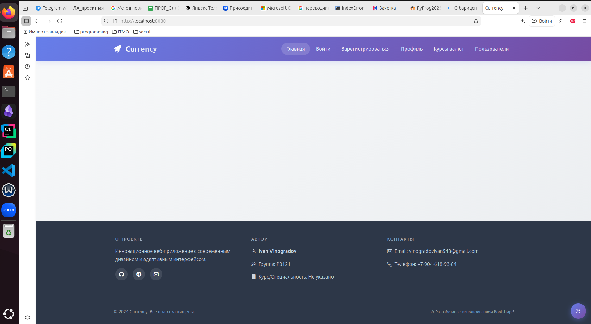
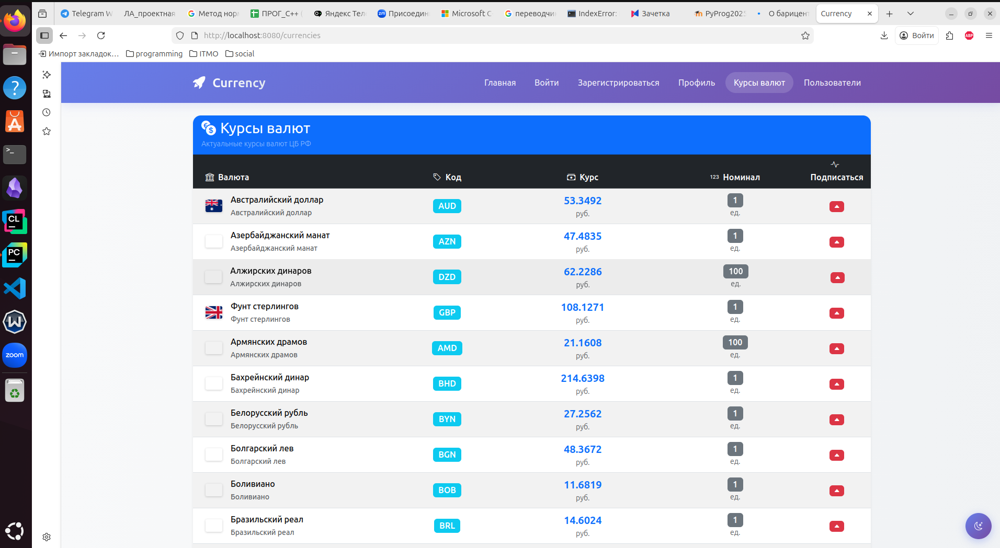
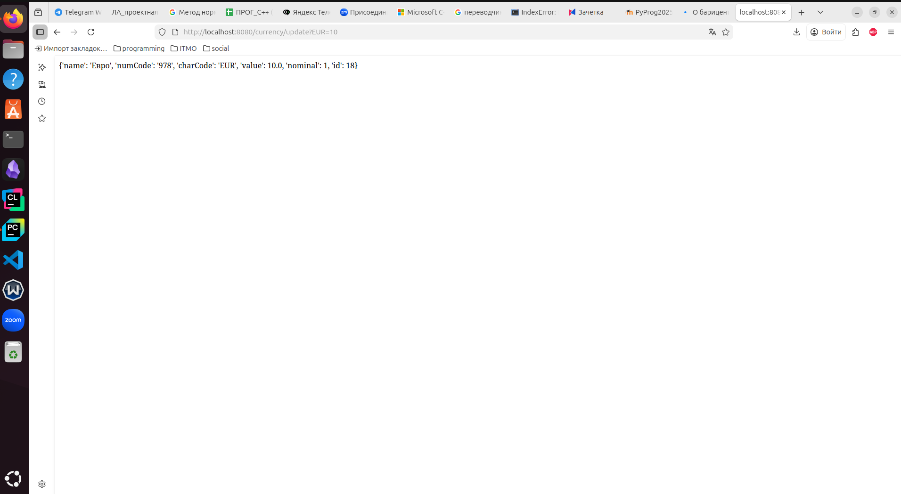
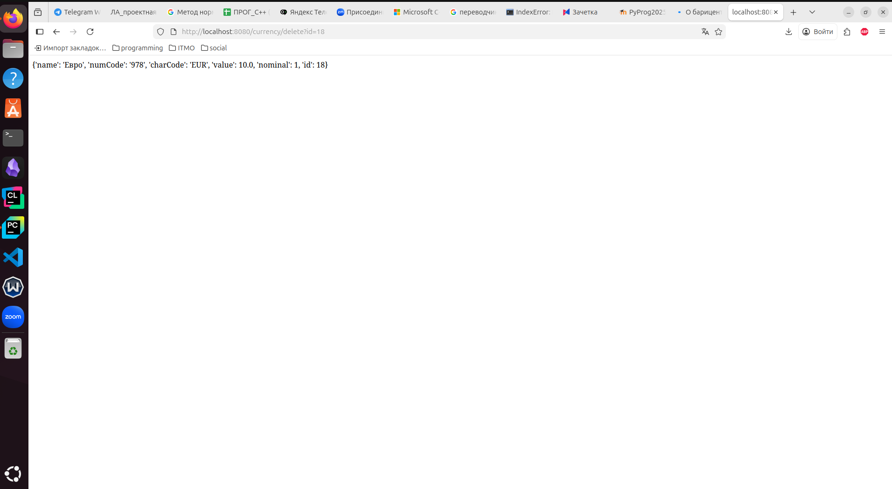
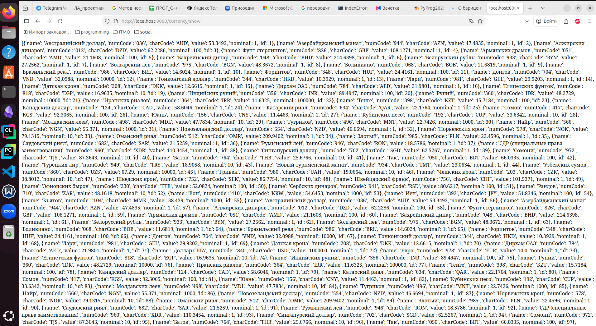
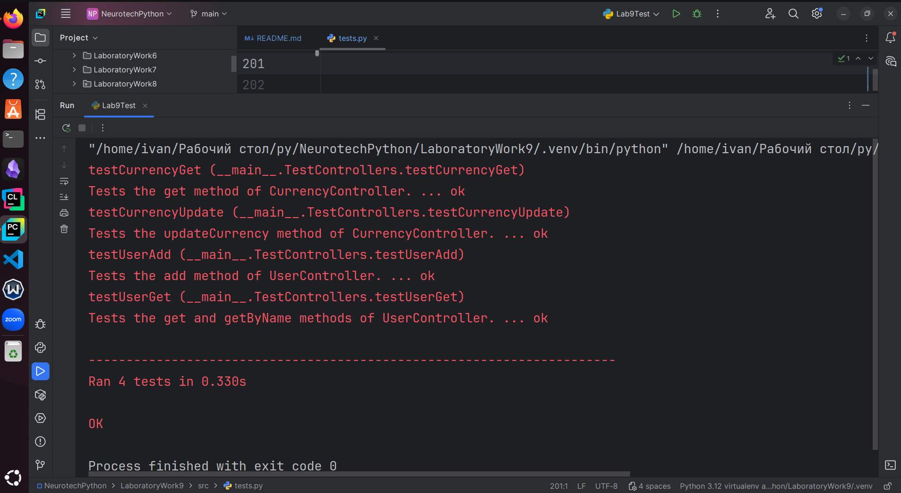

# A site for currency rates' tracking

## Purposes: 
- **learn to work with sqlite, realize CRUD and create site's API**
## Main models included:
- User
- Currency
- UserCurrency: represents a subscription of a user. It contains ids of both user and it's currency, realizing 'many to many' linking
- Author (of the application)
- App (the application itself)
## Base models (models-predecessors):
- BaseModel: represents an abstract model, consisting entirely of the only id field
- Human: representing an abstract human, including only a name.

## Files structure:
- `src/myapp.py` - contains the entry point
- `src/models/` - all the model classes
- `src/templates` - html templates
- `src/myTemplates` - additional html templates
- `src/utils` - other classes and functions that were useful when I was making the size
- `src/requests_handler.py` - realizes the server's working logic
- `src/data.py` - contains most of the project's global data and collects different sqlite api functionality
- `src/controllers/crud` - sqlite middle-level api
- `src/controllers/currency_controller.py` and `src/controllers/user_controller.py` - sqlite high-level api
- `src/controllers/rendering.py` - controllers for routes representing specific html pages
- `src/controllers/api.py` - controllers for routes representing api only
- `src/views.py` - html renderers

## Models in detail:
- **class** BaseModel
  - **private:**
    - __id: str
  - **public:**
    - id(set, get)
  - **restrictions:**
    - None
- **class** _Human_
  - **private:** 
    - __id: str
    - __name: str
  - **public:** 
    - id(set, get)
    - name(set, get)
  - **restrictions:**
    - name field must consist of at least one letter
- **class** _User_ **extends** BaseModel, Human
- **class** _Currency_ **extends** BaseModel
  - **private:**
    - __num_code: int
    - __char_code: str
    - __name: str
    - __value: float
    - __nominal: int
  - **public:** 
    - num_code(set, get)
    - char_code(set, get)
    - name(set, get)
    - value(set, get)
    - nominal(set, get)
    - parseDict() -> {
          "id": self.id,
          "name": self.name,
          "charCode": self.char_code,
          "value": self.value,
          "nominal": self.nominal,
      }
  - **restrictions:**
    - char_code's length must be equal to 3
    - name mustn't be empty
    - value and nominal must be positive
- **class** _UserCurrency_ **extends** BaseModel
  - **private:**
    - __user_id: str
    - __currency_id: str
  - **public:** 
    - user_id(set, get)
    - currency_id(set, get)
  - **restrictions:**
    - None
- **class** _Author_ **extends Human**
  - **private:**
    - __group: str
  - **public:**
    - group(set, get)
  - **restrictions:**
    - group must include at least 5 characters
    - group must have a leading upper-letter character
- **class** _App_
  - **private:**
    - __name: str
    - __author: _Author_
    - __version: str
  - **public:**
    - name(set, get)
    - author(set, get)
    - version(set, get)
  - **restrictions:**
    - name must include at least one letter
    - version can only consist of digits and dots
## CRUDs
- BaseCRUD (contains all the functionality). Main methods:
  - create
    ```python
    self._cursor.execute(
        f"""
        INSERT INTO {self._table_name} 
            ({",".join(self._keys[1:])}) 
            VALUES ({",".join(["?"] * len(self._keys[1:]))})
        """,
        self._parseToTuple(obj)[1:]
    )
    # Objects self._table_name, self._keys are safe
    # That query turns into the following one in UserCRUD class:
    # INSERT INTO users (name) VALUES (?)
    ```
  - read
    ```python
    self._cursor.execute(
        f"""
        SELECT * FROM {self._table_name} WHERE {attribute} = ?
        """,
        (value,)
    )
    # Objects self._table_name, self._keys are safe
    # Objects attribute and value are validated before usage
    # That query can turn into the following one in UserCRUD class:
    # SELECT * FROM users WHERE name = ?
    ```
  - readAll
    ```python
    self._cursor.execute(
        f"""
        SELECT * FROM {self._table_name} WHERE
            {attribute} IN ({",".join("?" * len(values))})
        """,
        values
    )
    # Objects self._table_name, self._keys are safe
    # Objects attribute and values are validated before usage
    # That query can turn into the following one in UserCRUD class:
    # SELECT * FROM users WHERE name in (?, ?, ?)
    ```
  - update
    ```python
    self._cursor.execute(
        f"""
        UPDATE {self._table_name} SET 
            {",".join(key + "=?"
                      for key in self._keys[1:])}
            WHERE {attribute} = ?
        """,
        self._parseToTuple(new_value)[1:] +
        (value,)
    )
    # Objects self._table_name, self._keys are safe
    # Objects attribute, value and new_value are validated before usage
    # That query can turn into the following one in UserCRUD class:
    # UPDATE users SET name=? WHERE name = ?
    ```
  - updateAll (the same with the previous one except using executemany instead of execute)
  - delete
    ```python
    self._cursor.execute(
        f"""
        DELETE FROM {self._table_name} WHERE {attribute} = ?
        """,
        (value,)
    )
    # Objects self._table_name, self._keys are safe
    # Objects attribute, value are validated before usage
    # That query can turn into the following one in UserCRUD class:
    # DELETE FROM users WHERE name = ?
    ```
  - deleteAll (the same, but with executemany)
- CurrencyCRUD (describes Currency in DB, extends BaseCRUD, overriding the constructor)
- UserCurrencyCRUD (describes Subscription in DB, extends BaseCRUD, overriding the constructor)
- UserCRUD (describes User in DB, extends BaseCRUD, overriding the constructor)
## High-level CRUD
- CurrencyController
  - Combines methods to deal with Currency and UserCurrency objects
  - It uses `get_currencies` method to get the current currency rates
- User Controller
  - Combines methods to deal with User objects

## Example of work
1. `/root`

2. `/currencies`

3. `/currency/update?EUR=10`

4. `/currency/delete?id=18`

5. `/currency/show`

## Testing
- All the tests are placed in `src/tests.py` in TestControllers class
## Here are some examples of the tests and their results
```python
def testCurrencyGet(self):
    """
    Tests the get method of CurrencyController.
    """
    mock_db = MagicMock()
    mock_db.read.return_value = Currency(**{
        "id": 1,
        "char_code": "USD",
        "value": 90,
        "num_code": "1010",
        "nominal": 1,
        "name": "USA"
    })

    controller = ctrs.currency_controller.CurrencyController(
        mock_db
    )
    result = controller.get(1)
    self.assertEqual(result.char_code, "USD")
    mock_db.read.assert_called()

# ----------------------------------------
def testCurrencyUpdate(self):
    """
    Tests the updateCurrency method of CurrencyController.
    """
    mock_db = MagicMock()

    mock_db.update.return_value = Currency(1, "50", "USD",
                                           "Dollar", 100, 1)

    controller = ctrs.currency_controller.CurrencyController(
        currencyCRUD=mock_db
    )
    result = controller.updateCurrency("USD", 100)
    self.assertAlmostEqual(result.value, 100.0)
    mock_db.update.assert_called_once()
# ----------------------------------------
def testUserGet(self):
    """
    Tests the get and getByName methods of UserController.
    """
    mock_db = MagicMock()
    users = [
        User(**{"id": 1, "name": "Ivan"}),
        User(**{"id": 2, "name": "Artyom"}),
        User(**{"id": 3, "name": "Yaroslav"})
    ]
    mock_db.read.side_effect = lambda attr, val: users[val - 1] \
        if isinstance(val, int) \
        else [i for i in users if i.name == val][0]
    controller = ctrs.user_controller.UserController(
        mock_db
    )
    result = controller.get(1)
    self.assertEqual(result.name, "Ivan")
    self.assertEqual(result.id, 1)
    result = controller.getByName("Ivan")
    self.assertEqual(result.name, "Ivan")
    self.assertEqual(result.id, 1)
    mock_db.read.assert_called()
# ----------------------------------------
def testUserAdd(self):
    """
    Tests the add method of UserController.
    """
    mock_db = MagicMock()
    users = []
    mock_db.create.side_effect = users.append
    controller = ctrs.user_controller.UserController(
        mock_db
    )
    controller.add(User(1, "Ivan"))
    controller.add(User(2, "Sasha"))
    self.assertEqual(len(users), 2)
    self.assertEqual(users[0].parseDict(), {"id": 1, "name": "Ivan"})
    self.assertEqual(users[1].parseDict(), {"id": 2, "name": "Sasha"})
    mock_db.create.assert_called()
```

## Conclusion
- MVC is a convenient method of structurizing an app. It helps to divide the code into small understandable independent pieces, so that the code starts to be more flexible
- Pure SQL syntax seems very weird. Moreover, it's unsafe to pass to sql queries an f-string with 'injections' (variables inserted). I wanted to create a powerful abstract BaseCRUD class, so that any CRUD could be created with only overriding the constructor. That is the reason I widely used formatted strings, but I validated all the data before it had passed to an sqlite query
- Another hardship I faced is that sqlite3 requires a commit operation after almost each query. Once you forget to commit, all the site stops working.